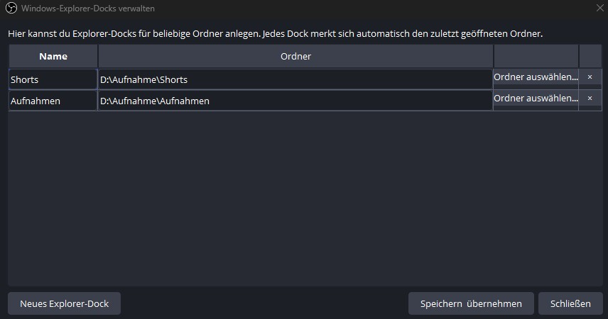
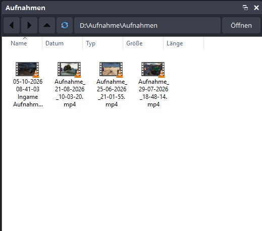

# Explorer Dock

[](https://github.com/xlTheCrow/explorer-dock/releases/latest)
[](https://github.com/xlTheCrow/explorer-dock/actions/workflows/build-windows.yml)
[](https://github.com/xlTheCrow/explorer-dock/releases)
[](LICENSE)


**Explorer Dock** is a free, open-source **OBS Studio plugin for Windows** that embeds a native **Windows Explorer / file browser dock directly inside OBS Studio**.

It is designed for streamers, video editors and creators who want faster access to **recordings, clips, thumbnails, project files and media folders** without constantly switching away from OBS. Explorer Dock works with **Windows 10 and Windows 11** and is currently built for **OBS Studio 32.x (64-bit)**.

> Current release: **v0.2.3** · Built for **OBS Studio 32.x / Windows x64**

## Download

➡️ **[Download the latest Explorer Dock release](https://github.com/xlTheCrow/explorer-dock/releases/latest)**

For v0.2.3, download:

`Explorer-Dock-v0.2.3-Windows-x64.zip`

## OBS Studio Windows Explorer Dock – Features

- Native Windows Explorer view directly inside OBS Studio
- Multiple independent Explorer docks
- Back, forward, parent-folder and refresh navigation
- Editable path bar with `Open / Öffnen`
- Native Windows file icons and thumbnails
- Native Windows context menus
- Windows Shell drag-and-drop support
- Remembers the last folder used by each dock
- German and English interface strings
- Versioned, ready-to-install Windows packages

## Screenshots

### Dock management



Create and manage multiple Explorer docks, choose their names and assign a start folder.

### Explorer Dock in OBS



The dock provides native Windows Explorer thumbnails, navigation controls and direct access to your files inside OBS.

## Requirements and compatibility

- Windows 10 or Windows 11
- 64-bit Windows
- OBS Studio 32.x, 64-bit

Other OBS versions may work, but are not currently guaranteed.

## Install Explorer Dock for OBS Studio

1. Close OBS Studio completely.
2. Open the [latest release](https://github.com/xlTheCrow/explorer-dock/releases/latest).
3. Download `Explorer-Dock-vX.Y.Z-Windows-x64.zip`.
4. Extract the **contents** of the ZIP directly into your OBS Studio installation folder.
5. Allow Windows to merge the included `obs-plugins` and `data` folders with the existing OBS folders.
6. Start OBS Studio.
7. Open **Tools → Windows Explorer Docks...**
8. Create a dock, choose a folder and select **Save & Apply / Speichern & übernehmen**.

The package uses the standard OBS folder layout:

```text
obs-plugins\
└── 64bit\
    ├── obs-explorer-dock.dll
    └── obs-explorer-dock.pdb

data\
└── obs-plugins\
    └── obs-explorer-dock\
        ├── manifest.json
        └── locale\
            ├── de-DE.ini
            └── en-US.ini
```

## Using the file browser dock in OBS Studio

Each dock behaves like a lightweight Windows Explorer embedded into OBS.

You can:

- navigate between folders
- double-click files and folders
- use native Windows context menus
- view Windows thumbnails
- drag files to other applications where supported
- enter a path manually in the address field
- press **Enter** or click **Open / Öffnen** to navigate to that path

Each Explorer Dock remembers the last folder you opened.

## Known limitations

- Windows only.
- The actual file view is provided by Windows through `IExplorerBrowser`.
- Because of that, the large Explorer area follows Windows styling instead of the active OBS theme.
- Explorer Dock creates its own Explorer browser view; it does not embed an already-open File Explorer window or tab.
- Small visual or behavioral differences can occur between Windows versions because the Shell UI is provided by the operating system.

## Troubleshooting

### Explorer Dock does not appear under Tools

Make sure the plugin files are located inside the OBS installation directory and that the DLL is here:

```text
obs-plugins\64bit\obs-explorer-dock.dll
```

Then restart OBS completely.

### The dock opens, but something behaves incorrectly

Open an issue and include your OBS log together with the steps required to reproduce the problem.

## Reporting bugs

Please use the [Bug Report template](https://github.com/xlTheCrow/explorer-dock/issues/new/choose) and include:

- Explorer Dock version
- OBS Studio version
- Windows version
- relevant OBS log lines
- exact reproduction steps
- screenshots when useful

## Feature requests

Ideas and improvements are welcome through the [GitHub issue tracker](https://github.com/xlTheCrow/explorer-dock/issues/new/choose).

## Building from source

Explorer Dock uses the official OBS plugin template build system and GitHub Actions for Windows builds.

The repository contains:

- C++ / Qt source
- OBS build metadata
- Windows build scripts
- automated Windows CI
- an automated GitHub release workflow

The `Publish Release` workflow creates versioned Windows packages such as:

```text
Explorer-Dock-v0.2.3-Windows-x64.zip
```

## AI-assisted development disclosure

Development of Explorer Dock was substantially assisted by OpenAI ChatGPT.

AI assistance was used for C++ implementation, build-system setup, debugging, packaging and documentation. Builds were validated through GitHub Actions, and functionality was manually tested in OBS Studio by the project owner.

## License

Explorer Dock is free software licensed under the **GNU General Public License version 2**.

See [LICENSE](LICENSE) for the full license text.

## Disclaimer

Explorer Dock is an independent community project and is **not affiliated with or endorsed by the OBS Project**.


## Keywords

OBS Studio plugin, Windows Explorer dock, OBS file browser, OBS dock plugin, Windows 11 OBS plugin, Windows 10 OBS plugin, creator workflow, recordings browser, clips browser, media file management.
